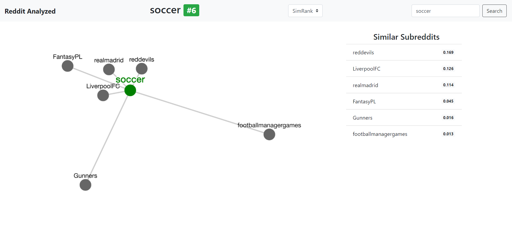

# Reddit Analyzed

Find similar subreddits using MinHash and SimRank algorithms.

Done as term project for CS425 Web-Scale Data course.

## Results

I implemented a graph visualization tool for results, using Cytoscape.js library.

You can check it out [here](https://ahmetcandiroglu.github.io/reddit-analyzed/).

 

Some examples:

Similar subs to [r/Python](https://www.reddit.com/r/Python)

 

Similar subs to [r/DotA2](https://www.reddit.com/r/DotA2)

 

Similar subs to [r/canada](https://www.reddit.com/r/canada)

 

Similar subs to [r/soccer](https://www.reddit.com/r/soccer)

## Algorithms Used

### MinHash

I used [MinHash](https://www.wikiwand.com/en/MinHash) algorithm to find number of common users of each subreddit.

[Jaccard Similarity](https://www.wikiwand.com/en/Jaccard_index) can be calculated using MinHash and it gives accurate and fast results. Number of common users can be calculated using Jaccard Similarity and number of users of each subreddit.

This was needed to preprocess user information which was the bottleneck of SimRank algorithm (~3M users) and ran SimRank on subreddits only.

### SimRank

[SimRank](https://www.wikiwand.com/en/SimRank) algorithm is an extension of [PageRank](https://www.wikiwand.com/en/PageRank) algorithm to find similarity in a graph.

Random walk with restarts approach gives pretty accurate similarity results.

After processing the dataset using MinHash, I ran SimRank on a graph where 
nodes represent subreddits and weighted edges represent number of common users if exists, like below.

## Collecting Data

Ran `crawler.py` on Heroku for 3 weeks and written the data in an Amazon RDS database.

Dataset contains,
* 8300 different subreddits 
* 3 million unique active users
* 10 million comments

Used PRAW library, a Python Reddit API wrapper.